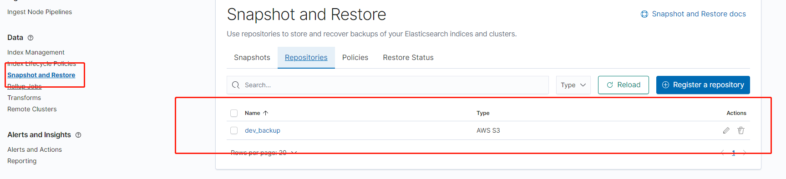

## 部署 Minio
目前是单机部署

1. 在 Minio 服务器安装 docker 和 docker-compose
   编辑 docker-compose.yml :
 ```
version: '3'
services:
  minio:
    restart: always
    image: minio/minio
    command: server /data --console-address ":9001"
    volumes:
      - /data/minio:/data
    ports:
      - "9000:9000"
      - "9001:9001"
    environment:
      MINIO_ROOT_USER: atai
      MINIO_ROOT_PASSWORD: wJalrXUtnFK7MDP
 ```
2. 修改 volumes 下 /mnt/data/minio 为本机挂载的磁盘目录 （必须）。
3. 修改 environment 下 MINIO_ROOT_USER 和 MINIO_ROOT_PASSWORD (可选)

4. 执行:
   `docker-compose up -d`

5. 执行 docker-compose ps 或 从浏览器端访问 9001 端口查看是否启动成功。
6. 在 web 界面创建 bucket： elasticsearch

## 配置 Minio S3 Client

1. 在 elasticsearch.yml 中添加  
`s3.client.minio.endpoint: "http://172.17.20.120:9000"`
2. 把minio加进elasticsearch-keystore
```shell
echo atai | /usr/share/elasticsearch/bin/elasticsearch-keystore add s3.client.minio.access_key -xf
echo wJalrXUtnFK7MDP | /usr/share/elasticsearch/bin/elasticsearch-keystore add s3.client.minio.secret_key -xf
```
3. 安装repository-s3插件
4. 滚动重启所有节点

## 配置 Minio Repository
### 使用命令行添加
```
PUT /_snapshot/minio
{
  "type" : "s3",
  "settings" : {
    "bucket" : "elasticsearch",
    "client" : "minio"
  }
}
```
### 使用 Kibana UI 添加 ( >= 7.5)
1. 访问 `kibana` -> `management` -> `Snapshot And Restore`
2. `Register a repository` -> `AWS S3`
3. `Client` 记得输入 `minio` （和上一步添加的 client 名保持一致）
4. `Bucket` 名和在 minio web 界面中创建的 `bucket` 名保持一致

### 检查是否添加上


## 配置备份规则
在kibana上执行
```shell
PUT _slm/policy/filebeat
{
  "name": "<filebeat-{now/d-1d{yyyy.MM.dd|+08:00}}>",
  "schedule": "0 30 17 * * ?",
  "repository": "dev_backup",
  "config": {
    "indices": [
      "<filebeat-7.12.1-{now/d-1d{yyyy.MM.dd|+08:00}}-*>"
    ],
    "ignore_unavailable": true,
    "include_global_state": false
  },
  "retention": {
    "expire_after": "60d",
    "min_count": 7,
    "max_count": 60
  }
}
```
以上是备份filebeat的样例  
对索引 **filebeat-7.12.1-*** 按天做 snapshot  
因为schedule是以UTC时间执行的，所以设置每天 17:30 （UTC）执行，也就是凌晨1:30分执行。  
保留最近 60 天备份，最少保留 7 个备份，最多保留 60 个备份。