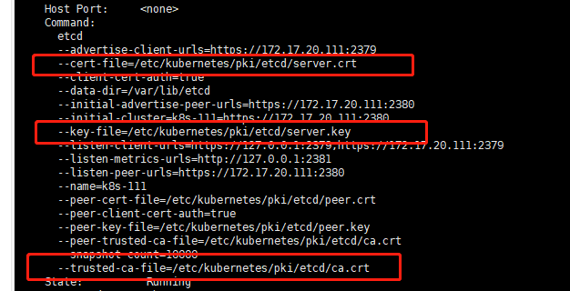

Document Url  
https://kubernetes.io/zh/docs/tasks/administer-cluster/configure-upgrade-etcd/

## Question 1
Make a backup of etcd running on cluster3-master1 and save it on the master node at /tmp/etcd-backup.db.  
Then create a Pod of your kind in the cluster.  
Finally, restore the backup confirm the cluster is still working and that the created Pod is no longer with us.
## Answer 1
### Step 1 
`ssh cluster3-master1`  
`kubectl get pods -n kube-system | grep etcd`  
`kubectl describe pod etcd-xxx -n kube-system`  
  

### Step 2
run command make a backup
```yaml
ETCDCTL_API=3 etcdctl --endpoints=https://127.0.0.1:2379 \
  --cacert=<trusted-ca-file> --cert=<cert-file> --key=<key-file> \
  snapshot save /tmp/etcd-backup.db
```
### Step 3
Create a pod for testing before restoring the backup and check if the pod exists after restoring the backup?
`kubectl run test --image=nginx`

### Step 4
```yaml
ETCDCTL_API=3 etcdctl --data-dir /tmp/ snapshot restore /tmp/etcd-backup.db
```
when restore success,we can see this pod not exist