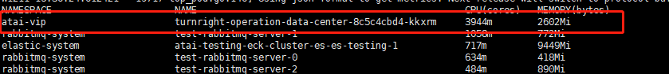

## Question 1
Output the pod name that uses most CPU resource to file /root/cka/name.txt
## Answer 1
### step 1
Get ready node count  
`kubectl top pod -A --sort-by='cpu'`  

###step 2
Get pod name  
`echo xxxx > /root/cka/name.txt`

