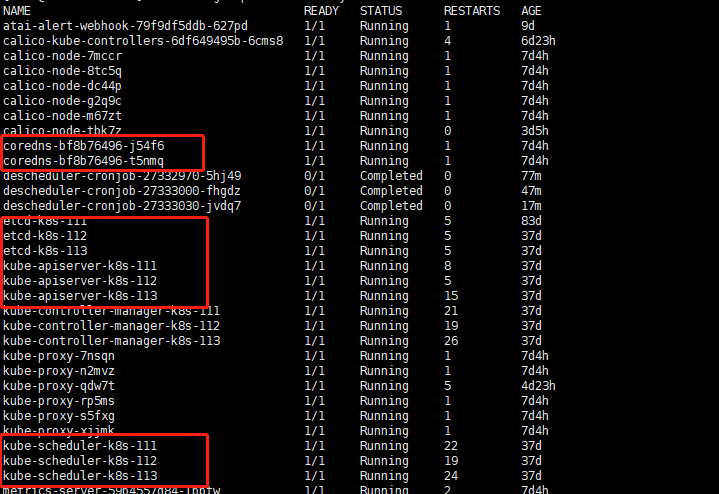

## Question 1
Ssh into the master node with ssh cluster1-master1. Check how the master components kubelet, kube-apisever, kube-scheduler,kube-controller-manager and etcd are started/installed on the master node.
Also find out the name of the DNS application and how it's started/installed on the master node.
Write your findings into file /opt/course/9master-components.txt. The file should be structured like.
```yaml
kubelet: [TYPE]
kube-apiserver: [TYPE]
kube-scheduler: [TYPE]
kube-contriller: [TYPE]
etcd: [TYPE]
dns: [TYPE]
```
Choices of [TYPE] are: not-installed, process, static-pod, pod
## Answer 1
### step1
`ssh cluster1-master1`  
`ps -ef | grep kubelet`  
It can be seen that this is a process
### step2
system components in the Namespace `kube-system` 
```shell
kubectl get pod -n kube-system  
```
  
if not exist,type is not-installed,if pod name format is  `podName-nodeName` type is static-pod,otherwise type is pod

