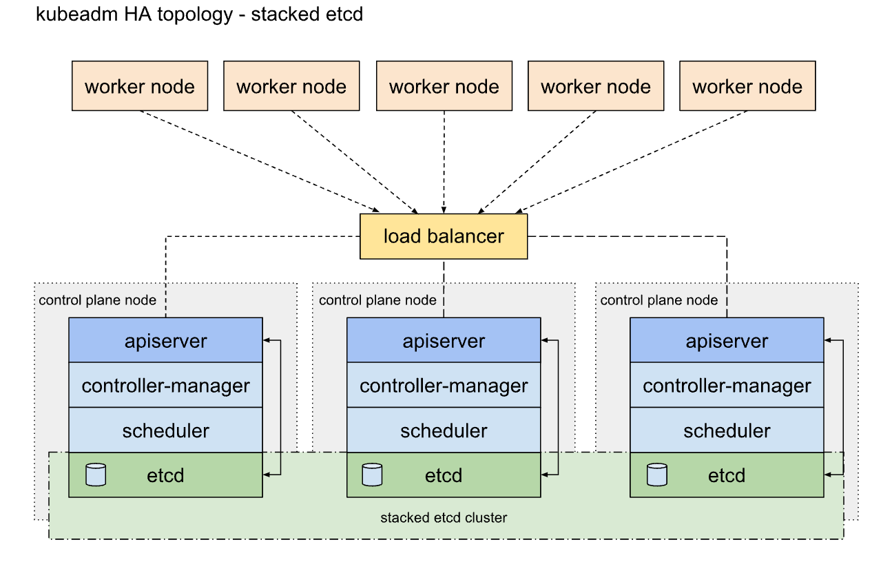

Kubernetes是谷歌以Borg为前身，基于谷歌15年生产环境经验的基础上开源的一个项目，Kubernetes致力于提供跨主机集群的自动部署、扩展、高可用以及运行应用程序容器的平台。
##  架构说明
### 一. 高可用架构图

###  二. **Master节点：整个集群的控制中枢**

1. **Kube-APIServer**：集群的控制中枢，各个模块之间信息交互都需要经过Kube-APIServer，同时它也是集群管理、资源配置、整个集群安全机制的入口。
2. **Controller-Manager**：集群的状态管理器，保证Pod或其他资源达到期望值，也是需要和APIServer进行通信，在需要的时候创建、更新或删除它所管理的资源。
3. **Scheduler**：集群的调度中心，它会根据指定的一系列条件，选择一个或一批最佳的节点，然后部署Pod。
4. **Etcd**：键值数据库，包括一些集群的信息，一般生产环境中建议部署三个以上节点（奇数个）。

### 三. **Node：工作节点**
1. **Kubelet**：负责监听节点上Pod的状态，同时负责上报节点和节点上面Pod的状态，负责与Master节点通信，并管理节点上面的Pod。
2. **Kube-proxy**：负责Pod之间的通信和负载均衡，将指定的流量分发到后端正确的机器上,查看Kube-proxy工作模式：  
    `curl 127.0.0.1:10249/proxyMode`  
    - Ipvs：监听Master节点增加和删除service以及endpoint的消息，调用Netlink接口创建相应的IPVS规则。通过IPVS规则，将流量转发至相应的Pod上。
    - Iptables：监听Master节点增加和删除service以及endpoint的消息，对于每一个Service，他都会场景一个iptables规则，将service的clusterIP代理到后端对应的Pod。
      其他组件
3. **Calico**：符合CNI标准的网络插件，给每个Pod生成一个唯一的IP地址，并且把每个节点当做一个路由器。Cilium
4. **CoreDNS**：用于Kubernetes集群内部Service的解析，可以让Pod把Service名称解析成IP地址，然后通过Service的IP地址进行连接到对应的应用上。
5. **Docker**：容器引擎，负责对容器的管理。