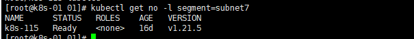
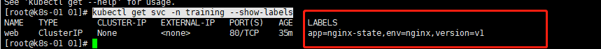
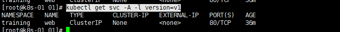
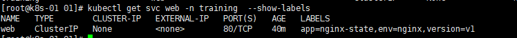
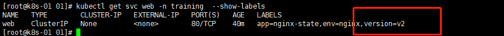
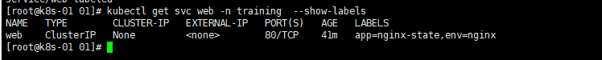

## 概念
- **Label**: 对k8s中各种资源进行分类、分组，添加一个具有特别属性的一个标签。
- **Selector**: 通过一个过滤的语法进行查找到对应标签的资源

## Label 和 Selector
当Kubernetes对系统的任何API对象如Pod和节点进行“分组”时，会对其添加Label（**key=value形式的“键-值对”**）用以精准地选择对应的API对象。而Selector（标签选择器）则是针对匹配对象的查询方法。
>注：键-值对就是key-value pair。  
例如，常用的标签tier可用于区分容器的属性，如frontend、backend；或者一个release_track用于区分容器的环境，如canary、production等。

### 一. 定义Label
### 应用案例
公司与xx银行有一条专属的高速光纤通道，此通道只能与192.168.7.0网段进行通信，因此只能将与xx银行通信的应用部署到192.168.7.0网段所在的节点上。  
此时可以对节点进行Label（即加标签）：  
`kubectl label node k8s-115 segment=subnet7`  
node/k8s-node02 labeled  
然后，可以通过Selector对其筛选：  
`kubectl get no -l segment=subnet7`  
  
最后，在Deployment或其他控制器中指定将Pod部署到该节点：  
```yaml
containers:
  ......
dnsPolicy: ClusterFirst
nodeSelector:
  segment: subnet7
......
```
也可以用同样的方式对Service进行Label：  
`kubectl label svc web -n training env=nginx version=v1`  
service/web labeled  
查看Labels：  
`kubectl get svc -n training --show-labels`  
  
还可以查看所有version为v1的svc：  
`kubectl get svc -A -l version=v1`  
  
其他资源的Label方式相同。  

### 二. Selector条件匹配
Selector主要用于资源的匹配，只有符合条件的资源才会被调用或使用，可以使用该方式对集群中的各类资源进行分配。  
假如对Selector进行条件匹配，目前已有的Label如下：  
`kubectl get svc -A --show-labels`  
选择app为reviews或者productpage的svc：  
`kubectl get svc -A -l  'app in (details, productpage)' --show-labels`  
选择app为productpage或reviews但不包括version=v1的svc：  
`kubectl get svc -A -l  version!=v1,'app in (details, productpage)' --show-labels`  
  
选择labelkey名为app的svc：  
`kubectl get svc -A -l app --show-labels`  

###  修改标签（Label）
在实际使用中，Label的更改是经常发生的事情，可以使用overwrite参数修改标签。  
修改标签，比如将version=v1改为version=v2：  
`kubectl get svc web -n training  --show-labels`  
  
`kubectl label svc web -n training  version=v2 --overwrite`  
service/canary-v1 labeled  
`kubectl get svc web -n training  --show-labels`  

###  删除标签（Label）
删除标签，比如删除version：  
`kubectl label svc web -n training version-`  
service/canary-v1 labeled  
`kubectl get svc web -n training  --show-labels`  

