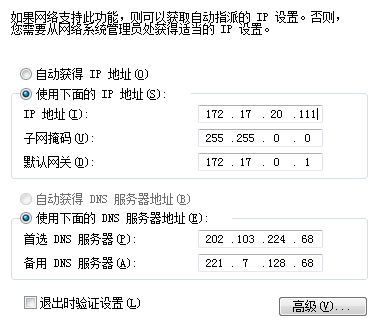
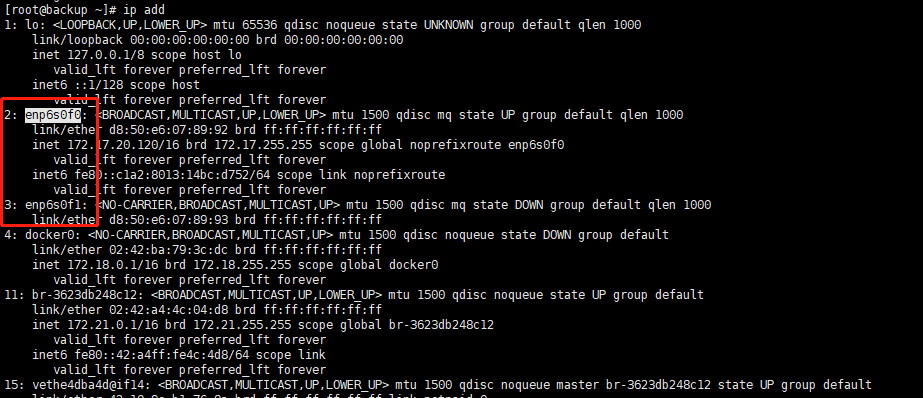
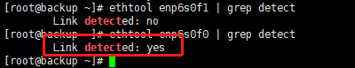

### 1. 下载iso文件，选择合适的版本下载
https://www.centos.org/download/  
下载DVD版本
### 2.先使用ultraiso 刻录镜像至U盘内（刻录时选择格式化成FAT32格式）
刻录教程 https://jingyan.baidu.com/article/6525d4b163d167ac7c2e9443.html
## 安装步骤
### 设置bios
设置bios mode 维ufdi模式  
### 选择第一项：
Install CentOS7，**回车继续等待**直到出现以 **dracut:/#** 开头的命令行  
因为你一开始不知道你的盘符，所以我们通过这一步去查看你的安装U盘的盘符，例如/dev/sdb4  
`ls /dev`  
### 清理RAID签名
以下命令也是在**dracut:/#** 中进行  
如果不操作这步，可能在安装的时候出现硬盘找不到的情况  
如何进入，在安装centos的时候不要指定路径，则可以进入一个可输入命令行的页面  
输入以下  
`dmraid -r`  
如果返回  
`no raid disks`  
则正常  
如果返回  
`/dev/sdb: ddf1, ".ddf1_disks", GROUP, ok, 3904294912 sectors, data@ 0`  
则有raid残留  
使用以下命令清除  
`dd if=/dev/zero of=/dev/sda bs=512 seek=$(( $(blockdev --getsz /dev/sda) - 1024 )) count=1024`  
https://blog.csdn.net/cuma2369/article/details/107666522

### 关机重启
`reboot`
### 设置系统镜像路径
此时重新进入了菜单  
选择第一项：Install CentOS7，按下 e 或者按键Tab ，看着提示来  
其中`sdb4` 是在dmraid界面的时候输入`cat /dev/*`查看，一般都是4结尾的  
修改下列命令：  
`Linuxefi /images/pxeboot/vmlinuzinst.stage22=hd:LABEL=CentOS\x207\x20x\86_64 quiet`  
更改为：  
`Linuxefi /images/pxeboot/vmlinuzinst.stage22=hd:/dev/sdb4 quiet`  

### 设置网卡
https://blog.csdn.net/johnnycode/article/details/40624403   
从一台window机器获取自己局域网的一些网络设置信息  
  

输入命令获取网卡信息  
`ip add`  

  

测试网卡是否接通网线  
`ethtool enp6s0f1 | grep detect`  
  
修改网卡信息  
`vim /etc/sysconfig/network-scripts/ifcfg-enp6s0f0`  
```properties
TYPE=Ethernet
PROXY_METHOD=none
BROWSER_ONLY=no
BOOTPROTO=static //修改类型为静态IP
DEFROUTE=yes
IPV4_FAILURE_FATAL=no
IPV6INIT=yes
IPV6_AUTOCONF=yes
IPV6_DEFROUTE=yes
IPV6_FAILURE_FATAL=no
IPV6_ADDR_GEN_MODE=stable-privacy
NAME=enp6s0f0
UUID=d5bf9f7e-63ac-42b6-81a6-6b0904502bfd
DEVICE=enp6s0f0
ONBOOT=yes
IPADDR=172.17.20.120 //修改IP地址
NETMASK=255.255.0.0 //修改子网掩码
GATEWAY=172.17.0.1 //修改网关
DNS1=202.103.224.68 //修改DNS服务器
DNS2=221.7.128.68
```
