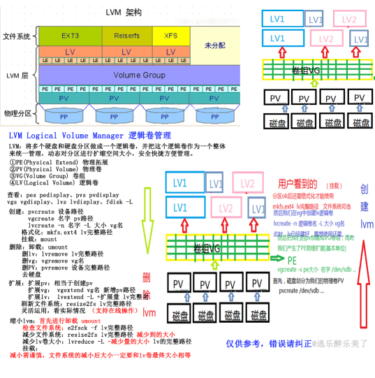
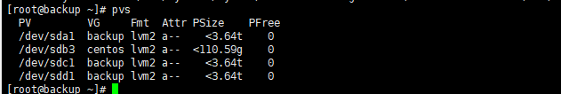
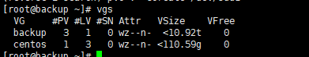
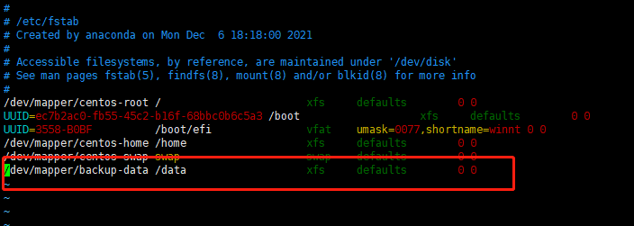
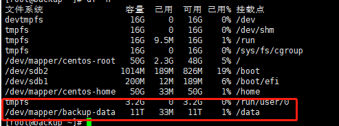

## 磁盘分区
查看未分区磁盘
`lsblk`
例如我们有一块sdb为分区
执行
`parted /dec/sdb`
执行挂载，所有容量分配到一个分区
`mkpart primary 2048s 100%`
## LVM
### 名词
- PE   (Physical Extend)     物理拓展
- PV   (Physical Volume)    物理卷
- VG   (Volume Group)       卷组
- LV   (Logical Volume)      逻辑卷

###举例
#### 1. pvs 查看当前 pv

#### 2. pvcreate 添加 sdb1 到 pv
`pvcreate /dev/sdb1`
#### 3. vgs 查看当前 vg

#### 4. vgextend 把该 pv 扩展到 vg
`vgextend backup /dev/sdb1`
#### 5. lvcreate 创建 lv
`lvcreate -L 10t  backup -n data`
#### 6. mkfs 格式化 lv
`mkfs.xfs -f  /dev/mapper/backup-data`
#### 7. lvextend 增加到逻辑卷
`lvextend /dev/mapper/backup-data -l+100%FREE`  
`xfs_growfs /dev/mapper/backup-data`  
#### 8. 挂载
`vim /etc/fstab`  
修改挂载配置  

检查是否挂载成功  

## 扩容
执行以上2,4,7步骤即可  
lvm支持动态扩容  
## 删除 unknown 设备
`vgreduce --removemissing VG`